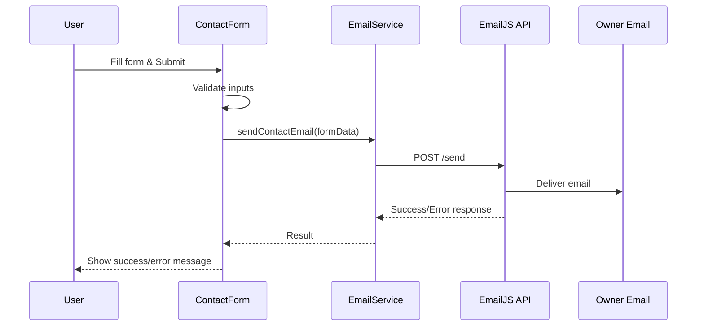

# Design Document: Contact Email Notification

## Overview

Tính năng này tích hợp dịch vụ gửi email vào contact form hiện có, cho phép chủ sở hữu website nhận email thông báo khi có người gửi tin nhắn. Sử dụng EmailJS - một dịch vụ email client-side phù hợp với React frontend apps không có backend.

## Architecture



## Components and Interfaces

### 1. Email Service Module (`services/emailService.ts`)

```typescript
interface ContactFormData {
  name: string;
  email: string;
  topic: 'collaboration' | 'mentorship' | 'freelance' | 'other';
  message: string;
}

interface EmailResult {
  success: boolean;
  error?: string;
}

// Main function to send contact email
async function sendContactEmail(data: ContactFormData): Promise<EmailResult>
```

### 2. Updated Contact Form Component

- Integrate với emailService thay vì simulate
- Handle loading, success, và error states
- Hiển thị error message khi gửi thất bại

### 3. Environment Configuration

```
VITE_EMAILJS_SERVICE_ID=your_service_id
VITE_EMAILJS_TEMPLATE_ID=your_template_id
VITE_EMAILJS_PUBLIC_KEY=your_public_key
```

## Data Models

### ContactFormData
| Field   | Type   | Required | Description                    |
|---------|--------|----------|--------------------------------|
| name    | string | Yes      | Tên người gửi                  |
| email   | string | Yes      | Email người gửi                |
| topic   | enum   | Yes      | Chủ đề: collaboration/mentorship/freelance/other |
| message | string | Yes      | Nội dung tin nhắn              |

### EmailPayload (sent to EmailJS)
| Field      | Type   | Description                    |
|------------|--------|--------------------------------|
| from_name  | string | Tên người gửi                  |
| from_email | string | Email người gửi                |
| topic      | string | Chủ đề tin nhắn                |
| message    | string | Nội dung tin nhắn              |
| timestamp  | string | Thời gian gửi (ISO format)     |

## Correctness Properties

*A property is a characteristic or behavior that should hold true across all valid executions of a system-essentially, a formal statement about what the system should do. Properties serve as the bridge between human-readable specifications and machine-verifiable correctness guarantees.*

### Property 1: Email payload completeness
*For any* valid contact form submission, the email payload sent to the email service SHALL contain all required fields: from_name, from_email, topic, message, and timestamp.
**Validates: Requirements 3.1, 3.2, 3.3, 3.4, 3.5**

### Property 2: Form validation prevents invalid submissions
*For any* form state with empty required fields (name, email, or message), the system SHALL reject the submission without calling the email service.
**Validates: Requirements 2.3**

### Property 3: Success state consistency
*For any* successful email service response, the UI SHALL transition to success state showing confirmation message.
**Validates: Requirements 1.2, 2.1**

### Property 4: Error state consistency
*For any* failed email service response, the UI SHALL transition to error state and maintain form data for retry.
**Validates: Requirements 1.3, 2.2**

### Property 5: Loading state during submission
*For any* form submission in progress, the submit button SHALL be disabled and loading indicator SHALL be visible.
**Validates: Requirements 1.4**

## Error Handling

| Error Type | Handling Strategy |
|------------|-------------------|
| Network error | Hiển thị error message, cho phép retry |
| Invalid credentials | Log error, hiển thị generic error message |
| Rate limiting | Hiển thị message yêu cầu thử lại sau |
| Validation error | Highlight invalid fields, không gọi API |

## Testing Strategy

### Unit Tests
- Test email payload construction với các input khác nhau
- Test form validation logic
- Test error handling scenarios

### Property-Based Tests
Sử dụng `fast-check` library cho property-based testing:

1. **Property 1**: Generate random valid form data, verify payload contains all required fields
2. **Property 2**: Generate form data with random empty fields, verify submission is rejected
3. **Property 3-5**: Test UI state transitions với mocked email service responses

### Integration Tests
- Test full flow từ form submission đến success/error state
- Test với mocked EmailJS responses
